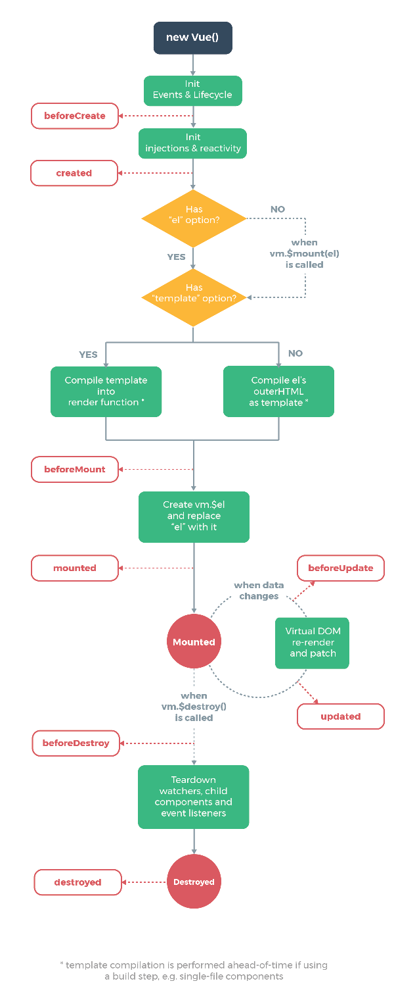

1주차 스터디 가이드 문서
======================

## 1. 환경설정 및 Vue의 이해 (09:00 ~ 09:50)
### 1.1 Node.js 및 NPM 설치
```이번 스터디에서 Node.js를 직접적으로 사용하지는 않지만 NPM(Node Package Manager)의 사용을 위해 설치합니다.```
#### 1.1.1 Node 설치 여부 확인(cmd)
```C:\Users\oxide>node --version```
     
#### 1.1.2 Node 설치
A. https://nodejs.org/ko/ 에서 설치파일 다운로드 및 실행

#### 1.1.3 Node 설치 여부 재확인(cmd)
```C:\Users\oxide>node --version``` 또는

```C:\Users\oxide>npm --version```

-----------------------------------------------------

### 1.2 Vue Cli 3 글로벌 설치

#### 1.2.1 cmd에서 글로벌 설치 명령어 수행
```npm install -g @vue/cli```
###### (참고) -g 옵션은 글로벌 설치를 의미합니다. (글로벌 설치일 때는 커맨드를 실행하는 위치 상관없음)
###### (참고) 글로벌 설치시 `C:\Users\%username%\AppData\Roaming\npm\node_modules` 하위로 설치됩니다. 

#### 1.2.2 글로벌 설치 여부 확인

###### cmd를 열고 아무 위치에서나 `vue ui` 명령어 입력하여 vue 프로젝트 세팅용 브라우저 화면이 표시되는지 확인

-----------------------------------------------------

### 1.3 Atom 및 플러그인 설치
###### (참고) Atom은 Github에서 제공하는 오픈소스 텍스트 에디터로, 프론트 개발시 Sublime Text, VS Code 등과 함께 종종 사용되고 있습니다.

#### 1.3.1 Atom 설치
A. https://atom.io/ 에서 설치파일 다운로드 및 실행

#### 1.3.2 Atom 플러그인 설치
###### (참고) Setting 메뉴 단축키 `Ctrl + ,(콤마)`

**[테마 설치]** 

A. Settings > Install > install Packages에서 Themes로 모드를 변경 후 아래 키워드 검색하여 설치
  * seti-ui
  * atom-material-syntax-dark
  
B. Settings > Themes > Choose a Theme > UI Theme에서 seti 선택하여 적용

C. Settings > Themes > Choose a Theme > Syntax Theme에서 Atom Material Dark 선택하여 적용

###### (참고) 이 테마는 파일 확장명에 따른 직관적인 아이콘과 색상 등으로 파일의 명확한 구분이 가능하게 해줍니다. (Atom 사용시 추천 테마)

  
**[플러그인 설치]**

A. Settings > Install > 상단 Install Themes에서 Packages로 모드를 변경 후 아래 키워드 검색하여 설치
  * language-vue
  * atom-beautify
  * autoclose-html
  * highlight-selected
  * color-picker
  * javascript-snippets
  * platformio-ide-terminal
  
###### (참고) Atom은 가벼운 에디터이지만 플러그인 기반으로 강력한 기능들을 사용할 수 있습니다. 위의 플러그인들은 vue 및 front 개발시 편의성을 제공하는 플러그인들입니다.

-----------------------------------------------------
  
### 1.4 Source Tree 설치 및 Github 프로젝트 생성
###### (참고) 소스트리는 Git을 시각적으로 보여주고 버전 관리하기 용이하도록 해주는 Git 전용툴입니다.

A. https://www.sourcetreeapp.com/ 에서 설치파일 다운로드 및 실행

※ 설치시 Atlassian 계정을 만들고 진행

B. https://github.com/new 로 접속해서 Github에 새로운 Repository로 `vue_study_week1`를 만들기

C. Git 저장소 URL을 복사한 후 Source Tree에 Clone으로 저장소 복제하기(로컬 Git 생성)


### 1.5 Vue 개요
#### 1.5.1 Vue의 특징 및 장단점
#### 1.5.2 Vue와 JQuery의 사용

-----------------------------------------------------

## 2. Vue 맛보기 (10:00 ~ 10:50)

### 2.1 최초의 Vue 컴포넌트 작성하기

A. 아래 파일을 받아서 vue_study_week1(로컬 Git)에 저장.
https://github.com/esperancer/tz_1909_vue_study/blob/master/week1/1_hello_world/1_1_hello_world_vue_sample.html

B. Hello, Vue World!를 찍어보기

-----------------------------------------------------

(참고 이미지) Vue MVVM 개요 

-----------------------------------------------------

### 2.2 Vue 라이프 사이클의 이해

(참고 이미지) Vue의 라이프 사이클 

#### 2.2.1 라이프 사이클의 순서 및 종류

**1. beforeCreate**

new Vue()로 Vue 컴포넌트가 생성되고 나서 가장 처음으로 실행되는 라이프 사이클 단계. 이 단계에서는 Vue 내부의 data, methods 속성 등에 아직 접근할 수 없고, 마찬가지로 DOM에도 접근할 수 없다.

**2. created**

beforeCreate 다음으로 실행되는 단계로 data, methods 속성이 정의되어 `this.data`등으로 접근이 가능하기 때문에 보통 AJAX 통신이 여기서 호출되는 경우가 많다. 단, Vue 컴포넌트가 아직 화면에 부착되기 전이기 때문에 template 속성에 정의된 DOM 요소에 접근할 수는 없다. 

**3. beforeMount**

template 속성에 지정한 마크업 속성이 있는 경우 이를 자바스크립트 render() 함수에 전달하기 전에 사용되는 라이프 사이클이다. 일반적인 경우 로직의 추가 빈도가 낮다.

**4. mounted**

화면 요소가 모두 부착되고 나서 호출되는 단계로 template 속성으로 표현된 화면 요소에 접근할 수 있으므로 페이지 로딩 후 기본값 세팅 및 화면 제어를 수행하기 적절한 단계. 다만 해당 컴포넌트가 부착되자마자 호출되기 때문에 하위 컴포넌트나 외부 라이브러리는 아직 완료되지 않은 상태일 수 있다.

**5. beforeUpdate**

뷰 인스턴스가 추적/감시하는 데이터가 변경되었을 때 화면 요소를 변경하기 위해 호출되는 단계. 변경 예정인 새 데이터에 접근할 수 있어서 변경 예정 데이터의 값과 관련된 로직을 추가로 넣을 수 있다.

**6. updated**

뷰 인스턴스가 추적하는 데이터가 변경되고 나서 화면을 새롭게 그린 후 호출되는 라이프 사이클. 이미 화면까지 변경이 완료된 상태이므로, 이 단계에서 데이터 조작을 시도하면 무한 루프가 발생한다. 화면 요소만 추가로 건드리는게 가능.

**7. beforeDestroy**

뷰 인스턴스가 제거되기 직전의 라이프 사이클. 이 단계에서는 아직 인스턴스 내부에 접근 가능하므로 뷰 인스턴스 데이터를 삭제하기 좋은 타이밍.

**8. destroyed**

뷰 인스턴스가 제거되고 나서 호출되는 단계. 별도로 사용되지 않음.

-----------------------------------------------------

## 3


## 2. 커리큘럼(초안)
  * 1주차(09.08 일요일 / 09:00 ~ 13:00)
     - 09:00 ~ 09:50
        - 환경설정(실습)
            * Node.js / NPM 설치
            * Vue CLI 3 글로벌 설치
            * Atom 설치
            * Atom 테마 및 플러그인 설치
            * Source Tree 설치
        - Vue의 이해
            * Vue의 특징 및 Vue의 장단점 설명
            * Vue와 JQuery를 사용할 때 주의할 점
     - 10:00 ~ 10:50
        - 최초의 Vue 어플리케이션 작성하기
            * Hello World 작성(실습) 및 Git 커밋하기
	    * MVVM 모델 간략 설명.
        - Vue의 라이프 사이클 이해하기
            * Vue 컴포넌트의 라이프 사이클 간단 설명
            * create, mounted, update, destroyed 등(실습)
        - Vue의 기본 문법 익히기(기본 디렉티브)
            * v-text, v-html
            * v-bind
     - 11:00 ~ 11:50
        - Vue의 기본 문법 익히기(기본 디렉티브)
            * v-model (양방향 디렉티브)
            * v-if / v-else / v-else-if
            * v-show
        - Vue의 기본 문법 익히기(반복 디렉티브)
            * v-for
     - 12:00 ~ 12:50
        - Vue의 기본 문법 익히기(기타 디렉티브)
            * v-pre
	    * v-once
        - Vue를 사용하는 세 가지 방법 설명
            * js 임포트 / CDN 방식 (사실상 동일)
            * SFC 방식 및 .vue 파일의 구조 설명(Single File Component)
            * SFC가 가지는 장점 및 차이점 소개
        - 향후 커리큘럼 진행 방향 안내
            * 왜 SFC를 써야하는가?
            * Webpack, Babel 등에 대한 간단 설명
